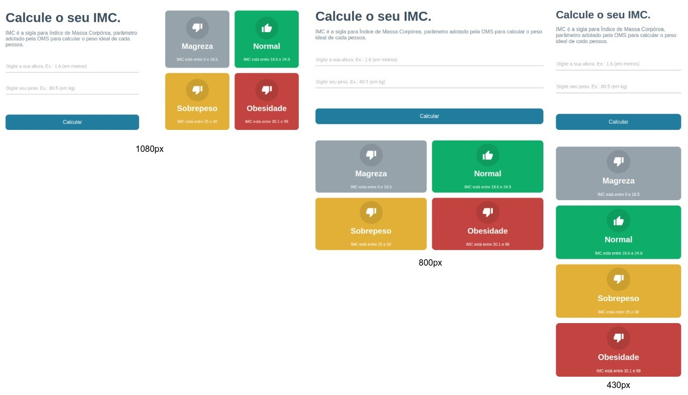

# IMC CALC

Projeto para medir o índice de massa corporal (IMC) do usuário. 

* Layout responsivo
* Projeto desenvolvido durante a curso de ReactJS da B7Web



### Demo

🔗 <a href="https://react-calc-imc-hazel.vercel.app" target="_blank">https://react-calc-imc-hazel.vercel.app</a>

### 🛠 Tecnologias

As seguintes ferramentas foram usadas na construção do projeto:

- [React](https://pt-br.reactjs.org/)
- [TypeScript](https://www.typescriptlang.org/)

### 👨‍💻 Instalação:
```=shell
    npm install
```

### 🚀 Executar:
```=shell
    npm run dev
```